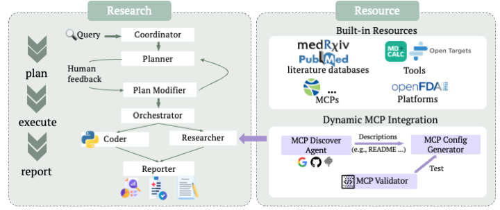

# Medical Deep Research (MedDR)

[](https://www.python.org/downloads/)
[](https://opensource.org/licenses/MIT)

<p align="center">
  
</p>

<p align="center"><b>Figure:</b> Medical Deep Research – Multi-agent, resource-rich system for clinical and biomedical inquiry.</p>

> **Medical Deep Research** - An open-source, agentic system for comprehensive medical and clinical investigations

## Overview

Medical Deep Research represents the convergence of large language models (LLMs), advanced reasoning, and information retrieval for expert-level medical inquiry. Our system addresses the limitations of existing Deep Research platforms by providing:

- **Reliability in high-stakes domains**: Access to full-text articles and specialized medical repositories
- **Dynamic integration of specialized resources**: Model Context Protocol (MCP) support with automatic discovery and validation
- **Flexible output formats**: Customizable reports tailored to specific clinical needs

## Core Architecture

### Research Module
Built on a multi-agent framework using LangGraph, featuring specialized agents:

- **Coordinator**: Entry point that manages workflow lifecycle and delegates tasks to appropriate agents
- **Planner**: Strategic task decomposition and planning with configurable research depth (low/medium/high)
- **Plan Modifier**: Incorporates human feedback to refine research plans iteratively
- **Orchestrator**: Coordinates execution phase by managing specialized agents and routing tasks between Researcher and Coder
- **Researcher**: Information gathering using medical tools, MCPs, and specialized databases
- **Coder**: Data analysis, calculations, and code execution using Python REPL
- **Reporter**: Customizable report generation with multiple output formats (long report, short summary, custom)

### Resource Module
Two complementary resource pillars:

1. **Built-in Resources**: Curated catalog of 10+ pre-integrated tools including:
   - Literature databases (PubMed, PMC, LitSense 2.0)
   - Clinical trial registries (ClinicalTrials.gov)
   - Drug databases (DrugBank, OpenFDA, ToolUniverse)
   - Pharmacovigilance repositories
   - Web search and crawling capabilities

2. **Dynamic MCP Integration Pipeline**: 
   - **MCP Discovery Agent**: Automatically finds medical MCP servers from search engines and GitHub
   - **MCP Config Generator**: Parses documentation and generates standardized configuration files
   - **MCP Validator**: Docker-based sandbox testing with iterative refinement for reliability

### Key Components

- **Query Processor**: Intelligent query transformation with strategies (DIRECT, PARAPHRASE, EXPAND) for optimal tool usage
- **ReAct Framework**: Enhanced reasoning capabilities for intelligent resource selection and decision-making
- **Human-in-the-Loop**: Interactive plan modification and feedback integration
- **Flexible Output System**: Dynamic prompt generation for customized report formats and styles

## Key Features

- **Comprehensive Coverage**: Access to extensive medical resources across literature, clinical trials, and specialized databases
- **Usability**: User-friendly interface with minimal code requirements
- **Flexibility**: Plug-and-play architecture for easy extension and customization
- **Verifiable Sources**: All references are tractable and verifiable
- **Clinical Accuracy**: Evaluated by board-certified medical specialists

## Quick Start

### Prerequisites
- Python 3.12+
- OpenAI API key (or other supported LLM providers)

### Setup

#### Backend Setup
```bash
# Clone the repository
git clone https://github.com/realYuanLi/meddr.git
cd meddr

# Create virtual environment
python -m venv meddr_env
source meddr_env/bin/activate  # On Windows: meddr_env\Scripts\activate

# Install backend dependencies
pip install -r requirements.txt

# Configure environment
cp conf.yaml.example conf.yaml
# Edit conf.yaml with your API keys

# Start the backend server
uvicorn main:app --reload
```

#### Frontend Setup
```bash
# Open a new terminal window
cd meddr/frontend

# Install frontend dependencies
npm install

# Start the frontend development server
npm run dev
```

#### Access the Application
- Frontend will be available at: `http://localhost:3000`
- Make sure both `.env` and `conf.yaml` are properly configured
- Frontend environment variables should be set in `.env.local` in the frontend directory

### Usage

- Access the web interface at `http://localhost:3000`
- Use the interactive chat interface for medical research queries
- Configure your API keys in the backend environment


## Contributing

We welcome contributions! Please see our [Contributing Guidelines](CONTRIBUTING.md) for details.


## License

This project is licensed under the MIT License - see the [LICENSE](LICENSE) file for details.

## Acknowledgments

Medical Deep Research builds upon the incredible work of the open-source community, particularly the LangGraph framework and the Model Context Protocol ecosystem.

---

**Impact**: Medical Deep Research is the first open-source, medically oriented Deep Research system, designed to serve as a transparent co-pilot for clinicians, researchers, and healthcare stakeholders.

